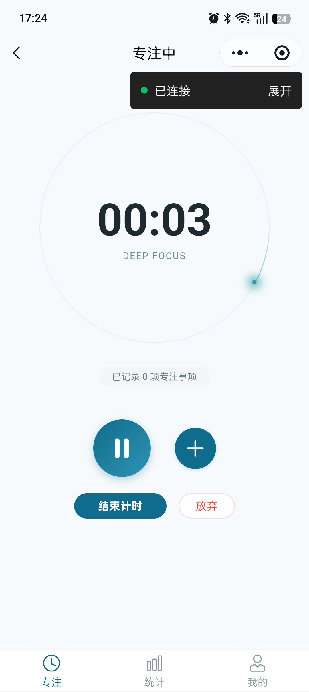
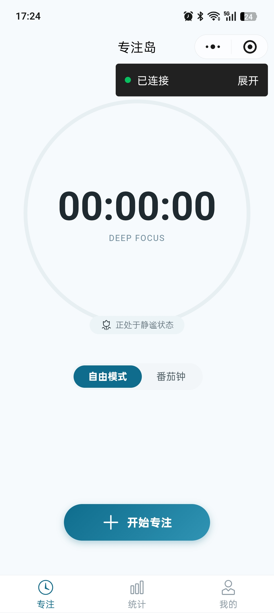
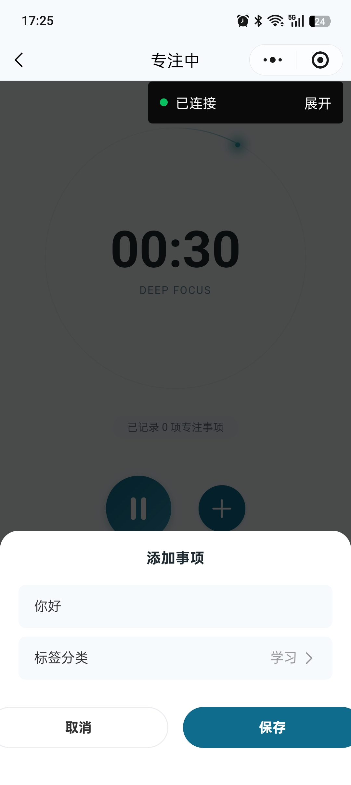
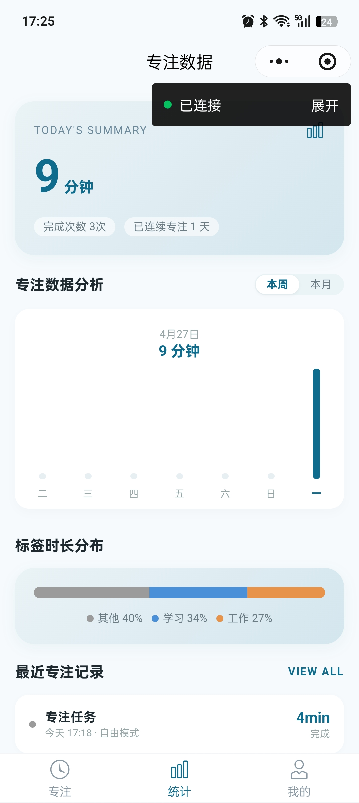
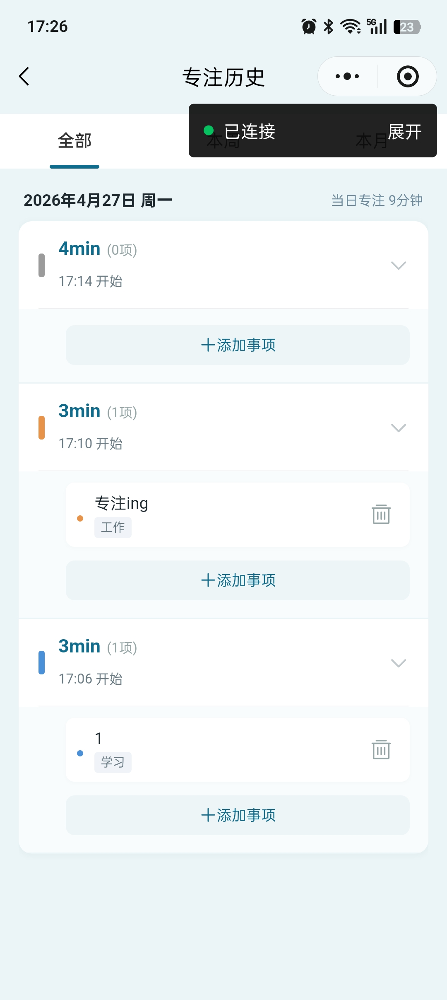

# 专注岛 Focus Island · 极简专注小程序

一款**微信小程序**形式的专注计时工具，主打「零摩擦启动 + 极简体验」。已上线微信小程序，拥有十余名真实用户。

> 项目周期：2026.04 – 2026.05 ｜ 作者：吕福星（AI 产品经理方向，软件工程本科）

---

## 一句话定位

市面上专注类 App 普遍功能堆叠、启动路径冗长。专注岛聚焦一件事：**让「开始专注」这件事本身足够轻**——点开即计时，待办随时补，不打断专注状态。

---

## 界面预览

| 首页 | 专注中 | 添加待办 |
|:---:|:---:|:---:|
|  |  |  |

| 数据统计 | 历史记录 |
|:---:|:---:|
|  |  |

---

## 核心功能

- **正向计时（自由模式）**：点击即开始，无预设时长，上限 8 小时自动停止；
- **番茄钟**：25 / 45 分钟等预设倒计时，到点提醒；
- **专注事项记录**：计时前 / 中 / 后随时添加、编辑、删除待办事项；
- **数据统计**：今日专注时长、累计时长与次数、分类标签统计；
- **历史记录**：专注记录本地持久化，可回溯。

---

## 技术栈

- **前端**：微信小程序原生框架（非 uni-app / Taro）+ Vant Weapp 组件库；
- **后端**：微信云开发 Serverless（云函数 + 云数据库 + 云存储）；
- **状态管理**：原生 globalData（不引入第三方库）。

---

## 核心产品决策（面试可讲）

1. **需求来源是真实访谈，不是拍脑袋**：前期访谈了 6 名目标用户（工作内容繁杂的职场人 + 学生），整理成需求分析，提炼出两个核心诉求——**零摩擦启动** 与 **待办随时编辑**。

2. **主动砍功能，而不是堆功能**：规划阶段曾考虑加入「AI 专注分析助手」，最终**主动砍掉**，理由是它违背了「极简专注」的产品理念。这是这个项目里最重要的一次取舍。

3. **MVP 边界清晰**：v1.0 只做「计时 + 事项 + 记录」闭环，不做社交、不做排行榜，保证核心流程能跑通。

> 完整需求分析见仓库内 [`prd.md`](prd.md)。

---

## 目录结构

```
focus-island/
├── pages/                 # 页面（首页 / 计时 / 记录 / 历史 / 统计 / 个人 / 设置等）
├── components/            # 自定义组件
├── custom-tab-bar/        # 自定义底部导航
├── cloudfunctions/        # 云函数
├── assets/screenshots/    # 界面截图（本 README 使用）
├── app.js / app.json      # 小程序入口
└── prd.md                 # 产品需求文档 v1.0
```

---

## 运行

1. 使用「微信开发者工具」导入本目录；
2. 在 `project.config.json` 中填入你自己的 AppID；
3. 云开发环境需开通云函数 / 云数据库（首次使用需在开发者工具中初始化）。

---

## 关于作者

计算机本科，AI 产品经理方向。这个项目是我的 0→1 产品实战：从**需求调研 → PRD → API 设计 → 技术选型 → UI → MVP 上线**完整走了一遍。

- 📮 邮箱：2660615517@qq.com
- 🐙 更多项目：[project-a-job-coach（AI 模拟面试官 Agent）](https://github.com/lvfuxing91-collab/project-a-job-coach)
